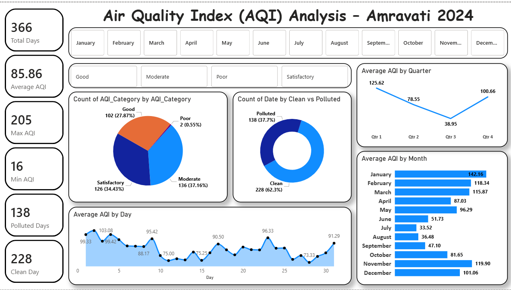

# Power BI Dashboard

This folder contains the Power BI dashboard file for the AQI Analysis project.

## File Included
- AQI_Dashboard.pbix

## Dashboard Image

## Dashboard Features
- KPI Cards
- Monthly AQI Trends
- Quarterly AQI Analysis
- AQI Category Distribution
- Clean vs Polluted Days
- Interactive Filters

## Key Insight
January recorded the highest average AQI
July showed the cleanest air quality
62.3% days were categorized as clean
Winter months showed higher pollution levels
Monsoon months showed lower AQI levels

## How to Use
Open the .pbix file in Power BI Desktop.
