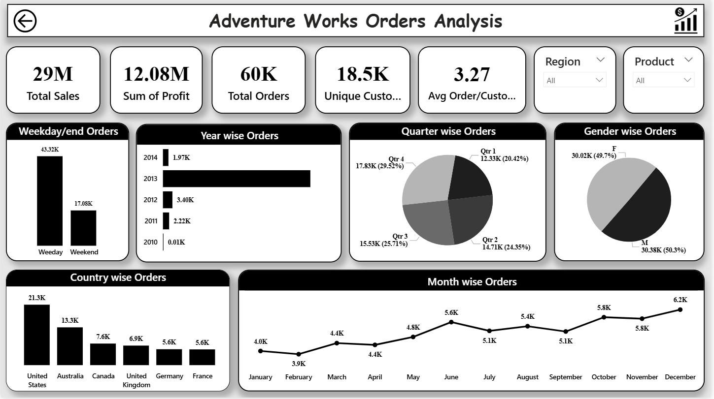

# 🚴 Adventure Works Sales Analysis

> **Tools Used:** Power BI · Tableau · Excel · MySQL  
> **Domain:** Bicycle Manufacturing & Retail  
> **Data Source:** Microsoft Adventure Works Sample Dataset  
> **Period:** 2010 – 2014

---

## 📌 Project Overview

Adventure Works Cycles is a Microsoft sample dataset representing a fictional bicycle manufacturing company.
This project performs a **complete end-to-end sales analysis** built across **four tools** — giving the same business problem four different analytical perspectives.

The goal was to analyze sales performance, profitability, order trends, customer behavior, and regional distribution to help business stakeholders make data-driven decisions.

---

## 🗂️ Files in This Project

| File | Tool | Description |
|---|---|---|
| `Internship_Project_Adventure_Works.pbix` | Power BI | Multi-page interactive dashboard |
| `Adventure_Works_Tableau.twbx` | Tableau | Sales performance dashboard |
| `Adventure_Works_Excel.xlsx` | Excel | Pivot table dashboard with slicers |
| `Adventure_Works_MySQL.sql` | MySQL | Data extraction and analysis queries |
| `screenshots/` | — | All dashboard preview images |

---

## 📊 Power BI Dashboard

**4 Pages:** Home · Sales Analysis · Orders Analysis · Profit Analysis

### 🏠 Home — KPI Overview

| Metric | Value |
|---|---|
| Total Sales | $29.4M |
| Total Profit | $12.1M |
| Profit % | 41.15% |
| Total Orders | 60K |
| Avg Order Value | $486.09 |
| Total Customers | 18K |
| Total Production Cost | $17.28M |

### 📈 Sales Analysis Page
- Sales by Year (2010–2014) — 2013 peak at $16.4M
- Sales by Country — US ($9.4M), Australia ($9.1M), UK ($3.4M), Germany ($2.9M), France ($2.6M), Canada ($2.0M)
- Quarter-wise Sales — Q4 strongest at 31.02% ($9.11M)
- Month-wise Sales trend — December highest at $3.2M
- Weekday vs Weekend — Weekday $21.1M (72%) vs Weekend $8.2M (28%)
- Gender-wise Sales — Female 50.46% vs Male 49.54%
- Interactive Region and Product slicers

### 📦 Orders Analysis Page
- 60K total orders across 18.5K unique customers
- Avg 3.27 orders per customer
- Year-wise orders — 2013 peak
- Country-wise — US (21.3K), Australia (13.3K), Canada (7.6K)
- Q4 highest orders at 29.52% (17.83K)
- December peak month at 6.2K orders

### 💰 Profit Analysis Page
- Total Profit $12.08M at 41.15% margin
- 2013 contributed $6.8M profit alone
- Q4 most profitable — $3.76M (31.14%)
- US profit $3.9M, Australia $3.7M
- Weekday profit $8.7M vs Weekend $3.4M

### Dashboard Preview





**Power BI Service Link:** Available on request (license-restricted to author)

---

## 📗 Excel Dashboard

**Single-page interactive dashboard** with pivot tables, slicers and charts.

### Visuals Included
- KPI cards — Total Sales ($2.93Cr) and Total Profit ($1.20Cr)
- Yearwise Sales bar chart (2010–2014)
- Monthwise Sales line chart
- Quarterwise Sales pie chart — Q4 (9,107K), Q1 (5,521K), Q3 (7,639K), Q2 (7,089K)
- Gender-wise Sales bar chart — Female ($14.8M) vs Male ($14.5M)
- Top 3 Region-wise Sales donut — Australia (9,061K), Southwest (5,718K), Northwest (3,650K)
- Sales Amount vs Production Cost combo chart (monthly)
- Weekday Sales bar chart — Tuesday highest (4,343K)
- Top 5 Products by Sales — Mountain-200 series dominates

### Slicers / Filters
- Year (2010–2014)
- Region (Australia, Canada, Central, France, Germany, Northeast, Northwest, Southeast, Southwest, UK)

### Dashboard Preview


**Google Drive Link:** [View Excel Dashboard](https://drive.google.com/drive/folders/1fsse-OBr0OXT2qOWerVSyUCwO3KWHgUe?usp=sharing)

---

## 📙 Tableau Dashboard

**Single-page Sales Performance Dashboard** with interactive filters.

### Visuals Included
- KPI banner — Total Sales (29.36M), Total Profit (12.08M), Profit % (41.15%), Total Orders (60.40K), Total Production Cost (17.28M)
- Month-wise Sales line chart — January (1.87M) to December (3.21M)
- Year-wise Sales bar chart — 2013 peak at 16.35M
- Quarter-wise Sales pie chart — Q1 (5.52M), Q2 (7.09M), Q3 (7.64M), Q4 (9.11M)
- Weekend vs Weekday donut — Weekday 71.90% vs Weekend 28.10%
- Sales vs Production Cost combo chart by year
- Weekday-wise Sales — Tuesday highest (4.34M), consistent across all days

### Dashboard Preview


**Tableau Public Link:** [View Live Dashboard](https://public.tableau.com/app/profile/piyush.dave4044/viz/projectgrpfile/Dashboard1)

---

## 🗄️ MySQL Queries

**Database:** `adventure_works`  
**Main Table:** `fact_internet_sales_new`, `dimproduct`, `dimcustomer`

### Queries Covered

| # | Query | Description |
|---|---|---|
| 1 | Product-Sales JOIN | Lookup product name from product sheet to sales — total sales per product |
| 2 | Customer-Product JOIN | Customer full name + product name + unit price using multi-table JOIN |
| 3 | Date Field Extraction | Extract Year, Month, Month Name, Quarter from `OrderDateKey` |
| 4 | Calculate Profit | `(UnitPrice × OrderQty × (1 - Discount)) - (StandardCost × OrderQty)` |
| 5 | Month-wise Sales | `monthname(orderDate)` grouped and ordered by sales descending |
| 6 | Year-wise Sales | Year-wise aggregated sales ordered ascending |
| 7 | Quarter-wise Sales | Quarter-wise sales using `Quarter(orderdate)` |
| 8 | KPI View | Created VIEW with Total Sales (29.36M), Order Quantity (60.40K), Total Profit (12.08M), Distinct Orders (27.66K) |
| 9 | Stored Procedure | `CustInfo(IN A INT)` — retrieves full name, total sales amount, and order count for any customer by key |

### Sample Queries

```sql
-- KPI Summary View
CREATE VIEW KPI AS
SELECT
    CONCAT(ROUND(SUM(SalesAmount)/1000000, 2), ' M') AS "Total Sales",
    CONCAT(ROUND(COUNT(OrderQuantity)/1000, 2), ' K') AS "Order Quantity",
    CONCAT(ROUND(SUM((UnitPrice * OrderQuantity * (1 - UnitPriceDiscountPct))
        - (ProductStandardCost * OrderQuantity))/1000000, 2), ' M') AS "Total Profit",
    CONCAT(ROUND(COUNT(DISTINCT salesordernumber)/1000, 2), ' K') AS "Distinct Orders"
FROM fact_internet_sales_new;

SELECT * FROM KPI;
-- Result: 29.36 M | 60.40 K | 12.08 M | 27.66 K

-- Stored Procedure: Customer Info
DELIMITER ==
CREATE PROCEDURE CustInfo(IN A INT)
BEGIN
    SELECT
        c.CustomerKey,
        CONCAT(c.firstname, ' ', c.MiddleName, ' ', c.lastname) AS "Full Name",
        SUM(f.salesamount),
        COUNT(DISTINCT f.orderquantity)
    FROM dimcustomer c
    JOIN fact_internet_sales_new f ON c.CustomerKey = f.CustomerKey
    WHERE c.CustomerKey = A
    GROUP BY c.CustomerKey, CONCAT(c.firstname, ' ', c.MiddleName, ' ', c.lastname);
END ==
DELIMITER ;

CALL custinfo(11002);
-- Result: CustomerKey 11002 | Ruben Torres | Sales: 8114 | Orders: 1
```

---

## 🔍 Key Business Insights

| # | Insight |
|---|---|
| 1 | **2013 was the peak year** — $16.4M revenue (56% of all 5-year sales) driven by product expansion |
| 2 | **US + Australia = 62% of revenue** — $9.4M and $9.1M respectively; top two markets by a wide margin |
| 3 | **Q4 dominates** every year at 31% of sales — December alone hits $3.2M, the best single month |
| 4 | **Weekday sales 2.5× higher** than weekends ($21.1M vs $8.2M) — suggests strong B2B and corporate buyer patterns |
| 5 | **Mountain-200 series is the star product** — appears 3 times in top 5, Mountain-200 Black 46 leads at $1.37M |
| 6 | **Profit margin healthy at 41.15%** against $17.28M production cost — business is operationally efficient |
| 7 | **Gender split nearly equal** — Female 50.46% slightly ahead, showing balanced customer base |

---

## 🧹 Data Preparation Steps

- Imported raw CSV tables into MySQL and Power Query
- Removed null values and duplicate order records
- Created date dimension fields (Year, Month, Quarter, Weekday flag) from `OrderDateKey`
- Built DAX measures in Power BI for Profit %, Avg Order Value, dynamic KPI cards
- Created pivot tables in Excel with Region and Year slicers
- Connected MySQL-cleaned data to Tableau for visualization

---

## 🔗 Links

| Platform | Link |
|---|---|
| 📊 Tableau Public | [Live Dashboard](https://public.tableau.com/app/profile/piyush.dave4044/viz/projectgrpfile/Dashboard1) |
| 📁 Excel (Google Drive) | [View Screenshots](https://drive.google.com/drive/folders/1fsse-OBr0OXT2qOWerVSyUCwO3KWHgUe?usp=sharing) |
| ⚡ Power BI Service | Available on request (license-restricted) |
| 💼 Portfolio | [GitHub Portfolio](https://github.com/PiyushDave30/data-analyst-portfolio) |

---

*Part of the [Data Analyst Portfolio](https://github.com/PiyushDave30/data-analyst-portfolio) by Piyush Dave — AI Variant Intern*
