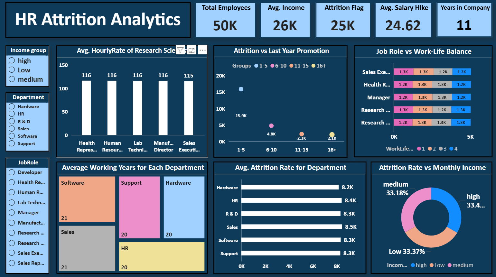

#  HR Attrition Analytics Dashboard (Power BI)

##  Project Overview
This project is an interactive **HR Attrition Analytics Dashboard** built in **Power BI** to analyze employee attrition trends, workforce performance, salary insights, promotions, departmental attrition, and employee experience.

The dashboard helps HR teams and management identify patterns behind employee turnover and make data-driven decisions to improve retention.

##  Objectives
- Analyze employee attrition across departments and job roles  
- Monitor important HR KPIs in one dashboard  
- Compare attrition with salary, promotions, and experience  
- Understand employee distribution through visuals  
- Improve workforce planning and retention strategies  

##  Key KPIs
- **Total Employees:** 50K  
- **Average Income:** 26K  
- **Attrition Count:** 25K  
- **Average Salary Hike:** 24.62  
- **Average Years in Company:** 11  

##  Dashboard Preview

##  Dashboard Features

###  Interactive Slicers
Users can filter the dashboard using:

- Income Group (High / Medium / Low)  
- Department  
- Job Role  

###  Visual Insights Included

#### 1️ Average Hourly Rate by Job Role
Compares average hourly rates across different employee roles.

#### 2️ Attrition vs Last Year Promotion
Shows employee attrition based on years since last promotion.

#### 3️ Job Role vs Work-Life Balance
Displays work-life balance ratings for different job roles.

#### 4️ Average Working Years by Department
Treemap visual showing department-wise employee experience.

#### 5️ Attrition Rate by Department
Compares attrition across all departments.

#### 6️ Attrition vs Monthly Income
Donut chart showing attrition percentage across income groups.

##  Key Insights
- Highest attrition is observed in employees with **1–5 years since last promotion**
- Sales department shows slightly higher attrition than others
- Income groups have almost equal attrition share
- Work-life balance remains similar across job roles
- Average experience is balanced across departments

##  Tools & Technologies Used
- **Power BI Desktop**
- Power Query
- DAX Measures
- Data Modeling
- Interactive Data Visualization

##  Live Dashboard
🔗 **Power BI Service Link:**  
[View Interactive Dashboard](https://app.powerbi.com/groups/me/reports/c2587b31-053f-4357-a8c7-afd3132b678c/0a6b35dd9028a8065c4c?experience=power-bi)

##  Skills Demonstrated
- HR Analytics  
- Dashboard Development  
- Data Cleaning  
- KPI Reporting  
- Business Intelligence  
- Storytelling with Data  
