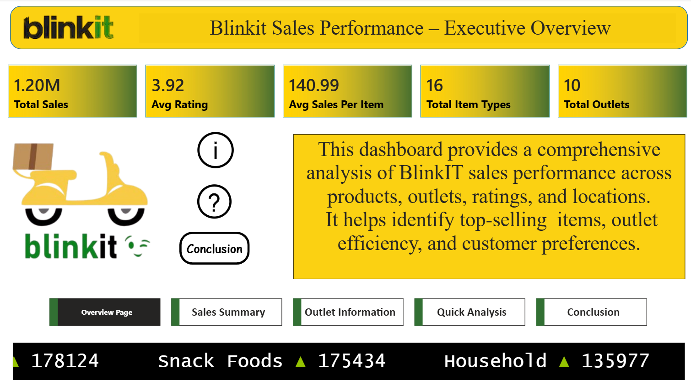
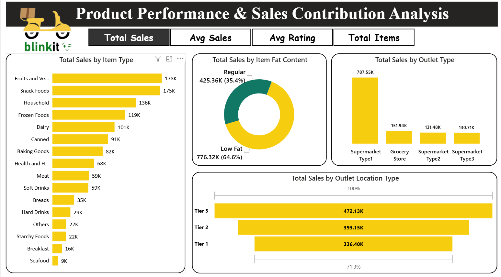
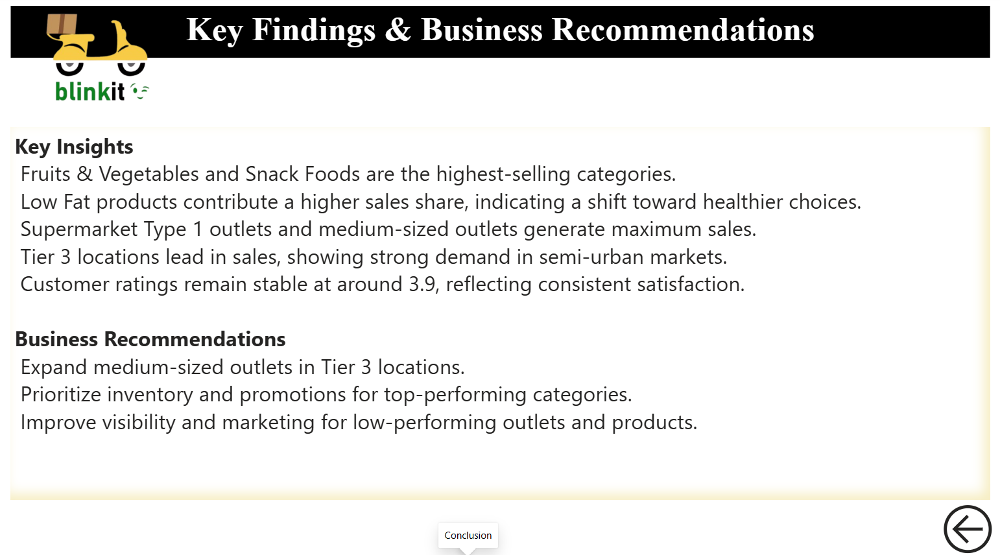

# BlinkIT Sales Performance Dashboard (Power BI)

## Project Overview
This project is an interactive **BlinkIT Sales Performance Dashboard** developed in **Power BI** to analyze sales trends, outlet performance, customer ratings, product demand, and location-wise business insights.

The dashboard provides a complete overview of BlinkIT operations and helps identify top-performing products, outlet efficiency, and growth opportunities.

## Objectives
- Analyze total sales performance across products and outlets  
- Compare outlet types, outlet sizes, and location tiers  
- Identify top-selling product categories  
- Track customer ratings and average sales per item  
- Support better inventory and expansion decisions  

## Key KPIs
- **Total Sales:** 1.20M  
- **Avg Rating:** 3.92  
- **Avg Sales Per Item:** 140.99  
- **Total Item Types:** 16  
- **Total Outlets:** 10  

## Dashboard Preview

### Executive Overview

### Product Performance & Sales Contribution Analysis

### Outlet Performance Analysis

### Quick Analysis

### Key Findings & Business Recommendations

## Dashboard Features

### Executive Overview
Provides a complete summary of sales, ratings, outlets, and product categories.

### Product Performance Analysis
- Total Sales by Item Type  
- Sales by Outlet Type  
- Item Fat Content Analysis  
- Outlet Location Tier Analysis  

### Outlet Performance Analysis
- Sales by Outlet Age Group  
- Outlet Establishment Year Analysis  
- Sales by Outlet Size  
- Outlet Type Performance Table  

### Quick Analysis
Interactive filtering by:
- Item Type  
- Outlet Location Type  
- Outlet Size  
- Item Fat Content  

### Recommendations Page
Business insights and suggestions based on dashboard findings.

## Key Insights
- **Fruits & Vegetables** and **Snack Foods** are highest-selling categories  
- **Low Fat** products contribute strong sales share  
- **Supermarket Type 1** generates maximum revenue  
- **Tier 3** locations perform best in sales  
- Medium-sized outlets contribute higher revenue  
- Customer ratings remain stable around **3.9**

## Tools & Technologies Used
- **Power BI Desktop**  
- Power Query  
- DAX Measures  
- Data Modeling  
- Dashboard Design  

## Skills Demonstrated
- Retail Analytics  
- Sales Dashboard Development  
- KPI Reporting  
- Business Intelligence  
- Data Visualization  
- Storytelling with Data  

