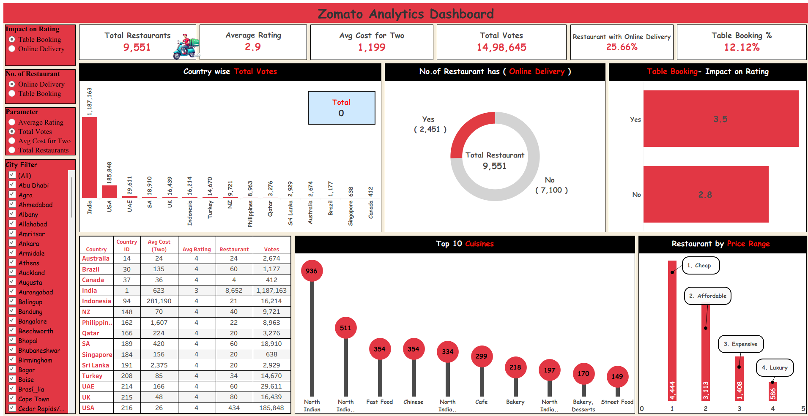
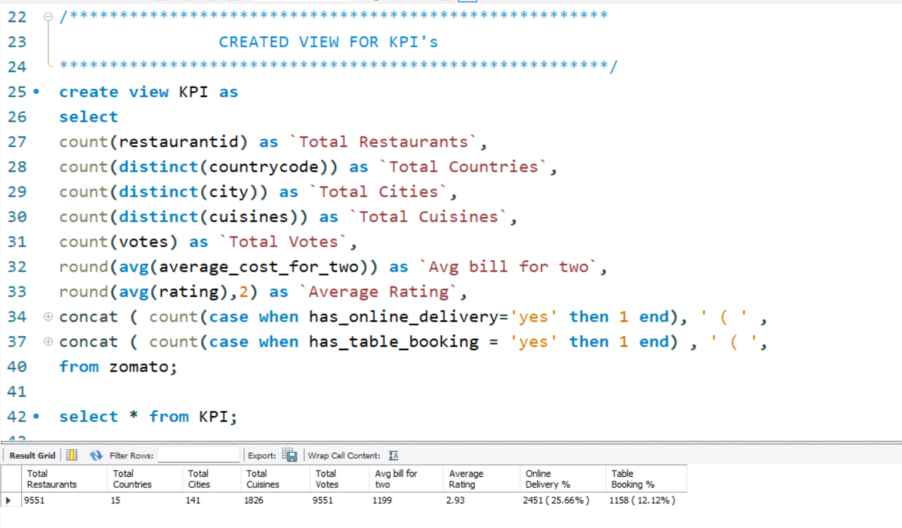
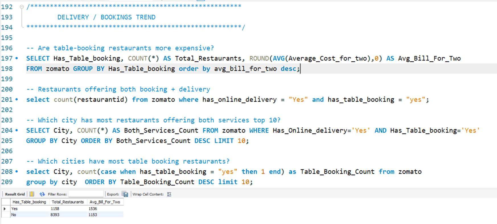
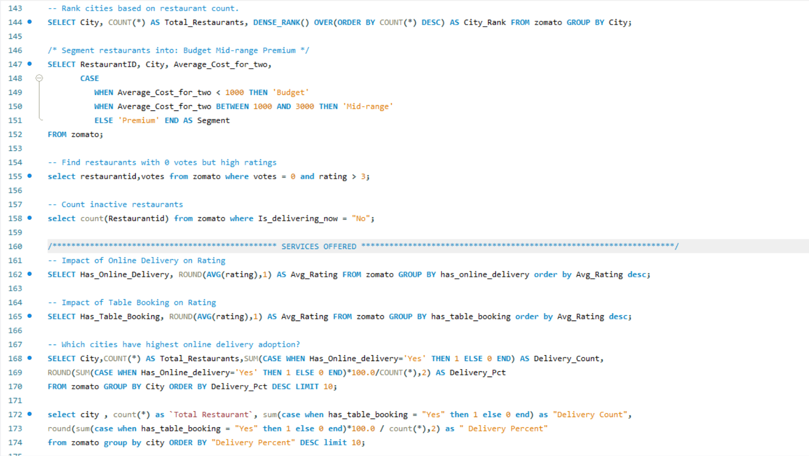

#  Zomato Sales & Rating Analysis (SQL + Tableau)

##  Project Overview
This project analyzes Zomato restaurant data using **SQL for business insights** and **Tableau for interactive dashboard visualization**. The project focuses on restaurant performance, ratings, delivery services, bookings, cuisines, city trends, and customer behavior.

##  Tools Used
- SQL (MySQL)
- Tableau
- Excel / CSV Dataset

##  Project Folder Structure

```text
Zomato-Sales-Rating-Analysis/
│── Data/
│── Files/
│── Screenshots
│── README.md
```

##  Live Dashboard Link
 **Tableau Public Dashboard**  
https://public.tableau.com/app/profile/piyushdave/viz/ZomatoTableauDB/Dashboard1

##  Dashboard Preview



##  Key Metrics
-  Total Restaurants: **9,551**
-  Average Rating: **2.9**
-  Avg Cost for Two: **₹1,199**
-  Total Votes: **14,98,645**
-  Online Delivery %: **25.66%**
-  Table Booking %: **12.12%**

##  SQL Analysis Performed

###  Z1 - Stored Procedure
Created a stored procedure using column name as input for dynamic analysis.


---

###  Z2 - KPI View
Created SQL View for important KPIs to monitor business values at a glance.



---

###  Z3 - Delivery / Booking Trends
Analyzed online delivery adoption and table booking trends.



---

###  Z4 - Cuisine Analysis / Customer Behavior
Analyzed popular cuisines, ratings, votes, and customer preferences.


---

###  Z5 - City Analysis / Revenue Analysis
Compared city-wise restaurant counts, revenue trends, and performance.


---

###  Z6 - Services Offered / Advanced Queries
Analyzed additional services and solved advanced business queries.



---

##  Tableau Dashboard (Z7)

Interactive dashboard built in Tableau covering:
- Restaurant KPIs
- Country-wise votes
- Online delivery analysis
- Table booking impact on ratings
- Top cuisines
- Price range segmentation
- Filters for city, parameter, and service type


---

##  Key Insights
- India has the highest restaurant count and total votes.
- Restaurants with table booking generally have better ratings.
- Only a smaller percentage of restaurants offer online delivery.
- North Indian cuisine is highly popular.
- Most restaurants fall under cheap and affordable price ranges.
- City-wise analysis helps identify high-performing markets.


##  Files Included
- Dataset File
- SQL Query File
- Tableau Workbook
- Dashboard Screenshots

##  Conclusion
This project demonstrates how SQL and Tableau can be combined to analyze restaurant industry data, generate insights, and build professional dashboards.
This project highlights my skills in **SQL querying, stored procedures, views, Tableau dashboarding, and business intelligence**.
