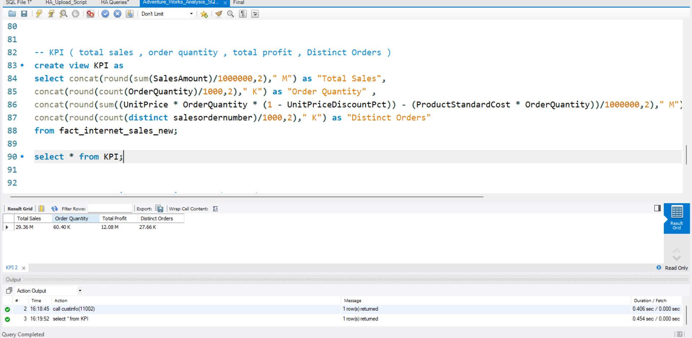

# Adventure Works Sales Analysis (SQL)

## 🔹 Project Overview
This project uses SQL to analyze sales data and extract meaningful business insights.

## 🔹 Tools Used
- SQL (MySQL / PostgreSQL)

## 🔹 Key Objectives
- Analyze sales performance
- Identify top customers and products
- Track revenue trends

## 🔹 Key Insights
- Identified top-performing products and customers
- Analyzed sales trends over time
- Found high-revenue regions

## 🔹 Dashboard Screenshots

## 🔹 Conclusion
This project demonstrates how SQL can be used to analyze data and support business decision-making.
