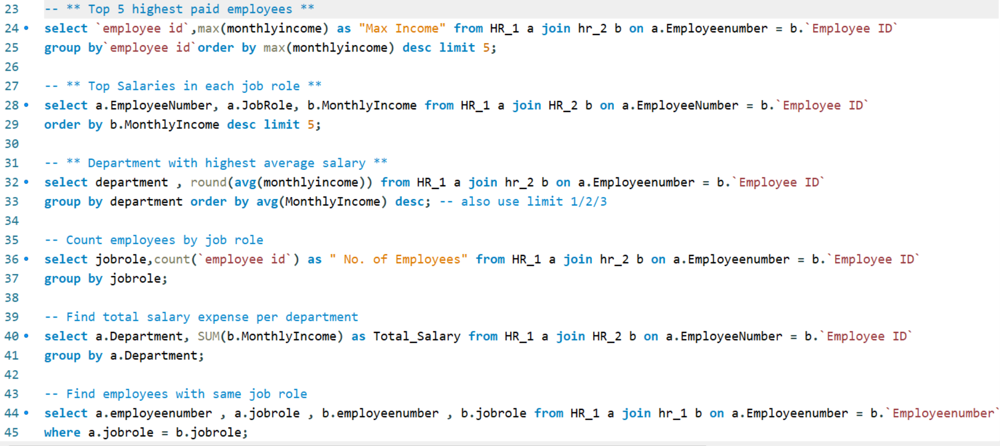

#  HR Attrition Analysis – SQL Server Project

##  Project Overview

This project focuses on **HR Attrition Data Analysis using SQL Server**.  
Two datasets named **HR1** and **HR2**, each containing **50,000 employee records**, were imported into SQL Server and joined together for complete workforce analysis.

Using SQL queries, this project identifies key insights related to:

- Employee attrition trends  
- Salary distribution  
- Department performance  
- Workforce demographics  
- Job role comparisons  
- Employee experience & tenure  
- Promotion and retention factors  

This project demonstrates how SQL can be used for real business decision-making and HR analytics.

#  Business Objective

The objective of this project is to help HR teams answer important questions such as:

✔ What is the overall attrition rate?  
✔ Which departments have highest attrition?  
✔ Who are the highest paid employees?  
✔ Does experience reduce attrition?  
✔ What is average salary by job role?  
✔ Which employees stayed longer?  
✔ Gender-wise workforce distribution?  

#  Tools & Technologies Used

| Tool | Purpose |
|------|---------|
| SQL Server | Data Analysis |
| SQL Queries | Business Insights |
| INNER JOIN | Merge HR Tables |
| Aggregate Functions | KPI Analysis |
| CASE Statements | Category Analysis |
| GitHub | Portfolio Showcase |

# Queries Screenshots





#  Dataset Information

This project uses two source files:

| File Name | Records | Description |
|----------|---------|-------------|
| HR1 | 50,000 | Employee personal & HR details |
| HR2 | 50,000 | Salary, experience & compensation details |

Both tables were connected using:

```sql
HR1.EmployeeNumber = HR2.Employee_ID
